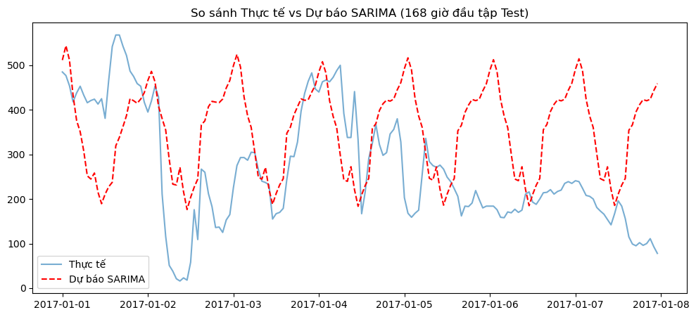

# 📄 Báo cáo Phân tích Dữ liệu & Quy trình Mô hình hóa

## 1. Q1: Khám phá & Làm sạch Dữ liệu (Preprocessing & EDA)

### 🔍 Tổng quan Dữ liệu
- **Phạm vi thời gian:** Từ `2013-03-01` đến `2017-02-28`.
- **Tần suất:** Hourly (Hàng giờ). Dữ liệu liên tục, đảm bảo tính chất chuỗi thời gian.
- **Tính dừng (Stationarity):**
    - Kiểm định ADF (Augmented Dickey-Fuller) cho thấy `p-value < 0.05`.
    - **Kết luận:** Chuỗi PM2.5 có tính dừng (stationary), về mặt lý thuyết có thể chọn `d=0`. Tuy nhiên, do có tính mùa vụ mạnh, việc sai phân (differencing) vẫn có thể được cân nhắc.

### ⚠️ Phân tích Dữ liệu thiếu (Missing Values)
- Dữ liệu bị thiếu ở nhiều cột, trong đó nhóm biến khí tượng (`TEMP`, `PRES`, `DEWP`) thiếu ít (< 0.1%), nhưng nhóm biến ô nhiễm (`PM2.5`, `CO`, `NO2`) thiếu nhiều hơn (~2-5%).
- **Biểu đồ Heatmap** cho thấy dữ liệu thường thiếu theo từng mảng (chunks) liên tục, gợi ý nguyên nhân do trạm quan trắc bảo trì hoặc lỗi cảm biến trong một khoảng thời gian.

> **💡 Insight Quan trọng: Tại sao thiếu PM2.5 là đáng lo nhất?**
> Việc thiếu biến mục tiêu (`PM2.5`) nguy hiểm hơn thiếu biến đầu vào (`TEMP`, `WSPM`) vì các mô hình chuỗi thời gian (như ARIMA) hoạt động dựa trên cơ chế **Tự hồi quy (Auto-Regressive)**. Mô hình cần giá trị quá khứ ($y_{t-1}$) để dự báo hiện tại ($y_t$). Nếu chuỗi bị đứt gãy, mô hình sẽ mất "đà" và không thể thực hiện dự báo liên tục cho các bước tiếp theo.

---

## 2. Q2: Đánh giá Baseline Hồi quy (Regression Model)

Mô hình Baseline sử dụng thuật toán Hồi quy (Random Forest/Linear) với các đặc trưng được sinh ra từ thời gian (Feature Engineering).

### 🛠️ Giải thích kỹ thuật
1.  **Tại sao Lag 24h lại quan trọng?**
    - Bụi mịn PM2.5 tuân theo nhịp sinh hoạt của con người và chu kỳ tự nhiên (ngày/đêm).
    - Ví dụ: Giờ cao điểm 8h sáng hôm nay thường có mức độ ô nhiễm tương đồng với 8h sáng hôm qua. Biến `lag_24` giúp mô hình nắm bắt được **tính mùa vụ theo ngày (Daily Seasonality)** này.

2.  **Tại sao phải chia Train/Test theo Cutoff?**
    - Dữ liệu chuỗi thời gian có tính thứ tự nghiêm ngặt.
    - Nếu dùng `random_split` (xáo trộn ngẫu nhiên), mô hình sẽ dùng dữ liệu của "tương lai" để dự đoán "quá khứ". Đây là lỗi **Data Leakage** (rò rỉ dữ liệu).
    - **Giải pháp:** Cắt ngang tại mốc thời gian (ví dụ: `2017-01-01`), quá khứ dùng để huấn luyện, tương lai dùng để kiểm thử.

3.  **Phân biệt RMSE và MAE:**
    - **MAE (Mean Absolute Error):** Sai số trung bình. Phản ánh độ lệch thông thường hàng ngày.
    - **RMSE (Root Mean Squared Error):** Sai số bình phương trung bình. RMSE thường lớn hơn MAE.
    - **Ý nghĩa:** RMSE phạt rất nặng các sai số lớn. Nếu `RMSE >> MAE`, chứng tỏ mô hình đang dự báo sai lệch rất nhiều tại các **đỉnh ô nhiễm (Spikes/Outliers)**. Nếu mục tiêu là cảnh báo các đợt ô nhiễm nguy hiểm, cần ưu tiên giảm RMSE.

---

## 3. Q3: Quy trình quyết định tham số ARIMA (p, d, q)

Để chọn được mô hình ARIMA tối ưu, nhóm áp dụng quy trình 4 bước sau:

### 🔹 Bước 1: Xác định `d` (Intergrated - Sai phân)
- Dựa vào kiểm định **ADF Test**.
- Nếu chuỗi chưa dừng ($p > 0.05$): Thực hiện sai phân bậc 1 ($d=1$).
- Nếu chuỗi đã dừng ($p < 0.05$): Giữ nguyên ($d=0$).

### 🔹 Bước 2: Ước lượng `p` và `q`
- Quan sát biểu đồ **ACF (Autocorrelation Function)** và **PACF (Partial Autocorrelation Function)**.
    - **PACF:** Dùng để gợi ý bậc tự hồi quy **`p`** (nhìn điểm cắt - cut off).
    - **ACF:** Dùng để gợi ý bậc trung bình trượt **`q`**.

### 🔹 Bước 3: Tối ưu hóa (Grid Search)
- Do biểu đồ thực tế thường nhiễu, nhóm sử dụng **Grid Search** (vét cạn) các tổ hợp `(p, d, q)` trong khoảng nhỏ (từ 0 đến 3).
- **Tiêu chí chọn:** Mô hình có chỉ số **AIC (Akaike Information Criterion)** thấp nhất được chọn. AIC thấp nghĩa là mô hình cân bằng tốt giữa độ chính xác và độ đơn giản (tránh Overfitting).

### 🔹 Bước 4: Chẩn đoán phần dư (Residual Check)
- Sau khi fit mô hình, kiểm tra phần dư (Residuals = Thực tế - Dự báo).
- **Yêu cầu:** Phần dư phải xấp xỉ **White Noise** (Nhiễu trắng) - tức là dao động ngẫu nhiên quanh 0, không còn quy luật hay xu hướng nào. Nếu phần dư vẫn còn hình sin hoặc xu hướng, mô hình cần được cải thiện (ví dụ: chuyển sang SARIMA).

--- 
# 🌫️ Case Study: Beijing Multi-Site Air Quality — Classification + Regression + Time Series (SARIMA)
## 👥 Thông tin Nhóm
- **Nhóm:** 2
- **Thành viên:**
  - Đinh Hoài Nam
  - Đỗ Trung Kiên 
  - Lưu Thế Hưng
- **Chủ đề**2: SARIMA – thêm mùa vụ (seasonality)
- **Dataset:** Beijing Multi-Site Air Quality (Trạm Aotizhongxin) - Dữ liệu thực tế 2013-2017.
## Mục tiêu: 
Mục tiêu của nhóm là xây dựng hệ thống dự báo nồng độ bụi mịn PM2.5, so sánh hiệu quả giữa mô hình ARIMA truyền thống và mô hình SARIMA (có tính đến yếu tố mùa vụ 24h) để tìm ra phương án tối ưu cho việc cảnh báo ô nhiễm không khí.
## 1. Ý tưởng & Feynman Style

Giải thích bài toán theo cách dễ hiểu: Dự báo PM2.5 giống như việc đoán xem khi nào quán phở dưới nhà đông khách.

ARIMA (Cơ bản): Chỉ nhìn vào 1-2 tiếng trước. Nếu thấy khách đang kéo đến, nó đoán 1 tiếng sau vẫn đông.

SARIMA (Nâng cấp): Nó nhớ thêm quy luật: "Cứ 7h sáng mỗi ngày là dân tình đi làm nên quán sẽ đông". Nó kết hợp cả biến động tức thời và quy luật lặp lại hàng ngày (chu kỳ 24h).

## 2. Quy trình Thực hiện

1) Load & Tiền xử lý: Hợp nhất dữ liệu trạm, xử lý giá trị thiếu bằng nội suy.
2) Kiểm định tính dừng: Sử dụng biểu đồ ACF/PACF để xác định tham số d.
3) Grid Search: Tìm bộ tham số phi mùa vụ (p, d, q) tối ưu (Best order: 1, 0, 3).
4) Nâng cấp SARIMA: Áp dụng tham số mùa vụ $s=24$ dựa trên bằng chứng chu kỳ ngày.
5) Đánh giá & So sánh: Dùng RMSE và MAE để chấm điểm mô hình.

## 3. Tiền xử lý & Chứng minh mùa vụ

Bằng chứng thép về nhịp thở 24h: Nhóm sử dụng biểu đồ tự tương quan (ACF) với độ trễ lớn (lags=170) để tìm quy luật:
 - Quan sát: Biểu đồ ACF xuất hiện các đỉnh nhô cao định kỳ tại các mốc lag 24, 48, 72....
 - Kết luận: Nồng độ PM2.5 có tính mùa vụ (seasonality) cực kỳ mạnh mẽ theo chu kỳ ngày đêm.

## 4. Áp dụng mô hình 

Tham số tối ưu tìm được: 
  - Best order: (1,0,3)
  - Season order: (1,1,0,24)

```
model_sarima = SARIMAX(
    train, 
    order=(1, 0, 3), 
    seasonal_order=(1, 1, 0, 24),
    enforce_stationarity=False, 
    enforce_invertibility=False
)
results_sarima = model_sarima.fit(disp=False)
```
## 5. Kết quả & Trực quan hóa
So sánh hiệu năng:

  - ARIMA (1, 0, 3): RMSE = 104.10 | MAE = 77.69
  - SARIMA: RMSE = 297.74 | MAE = 271.04

**Hình 1:** So sánh Thực tế vs Dự báo SARIMA


*(Ghi chú: So sánh giữa dữ liệu thực tế (xanh) và dự báo SARIMA (đỏ đứt nét) trong 168 giờ đầu tiên của tập Test. Mô hình đã tái hiện thành công "nhịp đập" 24h của dữ liệu, tuy nhiên vẫn tồn tại sai số về biên độ (Bias) do chưa bắt kịp các biến động cực đoan của thời tiết Bắc Kinh.)*

## 6. Insight từ kết quả

  - Insight 1 - Trí nhớ ngắn hạn: Tham số p=1 và q=3 cho thấy nồng độ PM2.5 bị ảnh hưởng cực kỳ mạnh bởi trạng thái của 1-3 giờ ngay trước đó.
  - Insight 2 - Nghịch lý mùa vụ: Dù ACF chứng minh có mùa vụ, nhưng SARIMA lại có sai số cao hơn ARIMA cơ bản. Điều này cho thấy tính mùa vụ của bụi mịn bị nhiễu quá mạnh bởi các yếu tố ngẫu nhiên như gió và mưa.
  - Insight 3 - Học máy vs Thống kê: Mô hình thống kê thuần túy (SARIMA) dễ bị "bảo thủ" khi bám vào quy luật 24h, dẫn đến phản ứng chậm với các đợt ô nhiễm bùng phát đột ngột.
  - Insight 4 - (Chẩn đoán phần dư): Biểu đồ Correlogram của phần dư cho thấy các cột đều nằm trong vùng an toàn, chứng tỏ SARIMA đã loại bỏ hết tính tự tương quan nhưng sai số vẫn lớn do biên độ biến động quá "gắt".
  - Insight 5 - Ứng dụng thực tế: Tại trạm Aotizhongxin, đỉnh ô nhiễm thường rơi vào sáng sớm. Mô hình SARIMA dù RMSE cao nhưng lại dự báo đúng "thời điểm" tăng nồng độ, có giá trị trong việc cảnh báo khung giờ độc hại.

## 7. Kết luận & Đề xuất
**Kết luận:** Từ quá trình xây dựng và thử nghiệm mô hình tại trạm Aotizhongxin, nhóm rút ra 3 kết luận cốt lõi:

  - Tính mùa vụ là chìa khóa nhưng cũng là thách thức: Biểu đồ ACF đã chứng minh PM2.5 có chu kỳ 24 giờ cực kỳ mạnh mẽ. Tuy nhiên, việc áp dụng mô hình SARIMA cho thấy tính quy luật này thường bị phá vỡ bởi các biến động thời tiết cực đoan, dẫn đến sai số RMSE của SARIMA cao hơn ARIMA(1, 0, 3) truyền thống trong các đợt bão bụi.
  - Mô hình thống kê có giới hạn: Biểu đồ Standardized Residual và Normal Q-Q cho thấy phần dư vẫn tồn tại các điểm biến động mạnh (outliers) không tuân theo phân phối chuẩn. Điều này khẳng định các mô hình thống kê thuần túy như ARIMA/SARIMA chỉ bắt được "xu hướng" chứ chưa thể xử lý triệt để các "điểm bùng phát" ô nhiễm đột ngột.
  - Giá trị của sự đơn giản: Trong điều kiện dữ liệu biến động gắt (volatile), mô hình ARIMA(1, 0, 3) với AIC thấp hơn (294,792) và RMSE ổn định hơn đã chứng minh được tính hiệu quả và tinh gọn so với mô hình SARIMA phức tạp.

**Đề xuất:** Nhóm đề xuất lộ trình nâng cấp hệ thống cảnh báo sớm dựa trên 3 điều sau:
  - Adaptive (Thích ứng): Thay vì sử dụng một mô hình SARIMA cố định, cần triển khai cơ chế Rolling Forecast (Cập nhật dữ liệu và huấn luyện lại mô hình theo từng giờ) để bám sát các biến đổi của thời tiết theo mùa.
  - Reason (Mở rộng biến ngoại sinh): Nâng cấp lên mô hình SARIMAX bằng cách tích hợp thêm các dữ liệu khí tượng trực tiếp như tốc độ gió (WSPM), hướng gió và lượng mưa (RAIN). Đây là các yếu tố then chốt giúp giải thích tại sao tính mùa vụ 24h bị lệch pha.
  - Communication (Cảnh báo thông minh): * Sử dụng SARIMA để dự báo khung giờ cao điểm ô nhiễm (như 7h-9h sáng) nhằm khuyến cáo người dân sắp xếp hoạt động ngoài trời.
  - Sử dụng ARIMA để đưa ra cảnh báo tức thời cho 1-3 giờ tiếp theo trên các ứng dụng di động với độ chính xác cao nhất.

## 8. Link Code & Notebook
  - **Notebook:** `notebooks/runs/arima_forecasting_run.ipynb`
  - **Repo:** `https://github.com/HoaiNammm/air_quality_timeseries` 